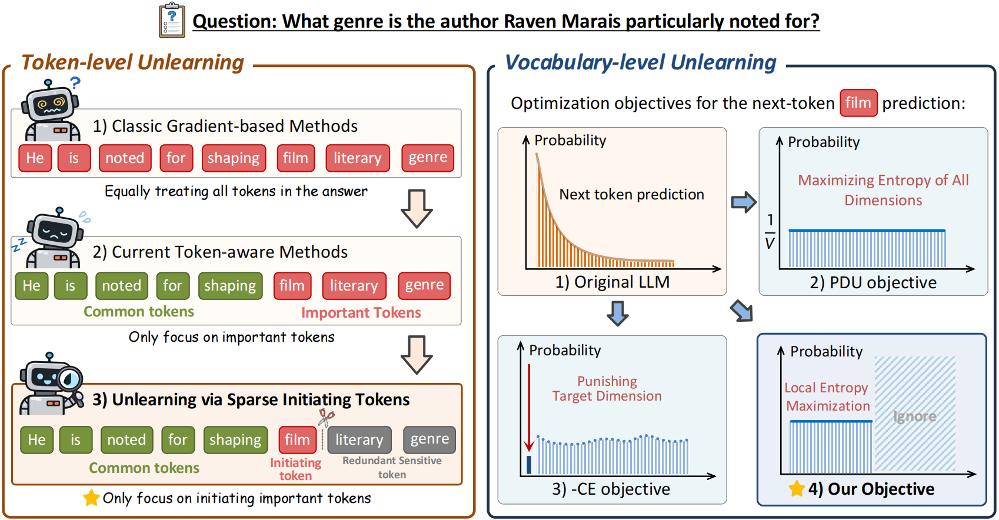

<h1 align="center">
Maximizing Local Entropy Where It Matters: Prefix-Aware Localized LLM Unlearning
</h1>

<div align="center">
  <a href='https://arxiv.org/pdf/2601.03190'></a>  &nbsp;
  <a href="https://github.com/nxZhai/PALU"></a> &nbsp; 
  <a href="https://github.com/nxZhai/PALU"></a> &nbsp;
  <br>
</div>



---

## 🔥 News


## ⚡ Installation

### Set up the Environment

```bash
conda create -n palu python=3.11.13 -y
conda activate palu

bash env_setup.sh
```

### Dataset Preparation

TOFU and MUSE benchmarks are used for evaluation.

- [TOFU](https://huggingface.co/datasets/locuslab/TOFU)
- [MUSE](https://huggingface.co/datasets/muse-bench/MUSE-News)

For example, use Hugging Face CLI to download TOFU and MUSE datasets.

```bash
# TOFU benchmark
hf download --repo-type dataset locuslab/TOFU

# MUSE benchmark
hf download --repo-type dataset muse-bench/MUSE-News
hf download --repo-type dataset muse-bench/MUSE-Books
```

### Prepare the Original Models

We use the official original models provided by Open-Unlearning and MUSE.

```bash
# TOFU Original Model
hf download open-unlearning/tofu_Llama-2-7b-chat-hf_full

# MUSE Original Model
hf download muse-bench/MUSE-books_target
hf download muse-bench/MUSE-news_target
```

## 🧩 Finetune

We directly use the **Original Model** and **Retain Model** provided by **Open-Unlearning** to perform unlearning and evaluation.

## 🧪 Unlearning

Directly perform PALU, starting from the original models provided by Open-Unlearning.

```bash
# Llama-2-7b-chat-hf
bash scripts/unlearn/tofu/train_tofu_palu_llama2.sh

# Llama-3.1-8B-Instruct
bash scripts/unlearn/tofu/train_tofu_palu_llama3.sh
```

## 📊 Evaluation

We enable **evaluation at every epoch** during training, making it easy to track and compare performance changes over time. By default, we report the two most widely used metrics: **Forget Quality** and **Model Utility**.

You can add or remove evaluation metrics in `configs/eval/tofu.yaml` and `configs/eval/muse.yaml`. For detailed implementation and metric computation, please refer to the **Open-Unlearning** source code and the corresponding paper.

> **Note:** For the performance of the **Original Model** and **Retain Model**, we evaluate using the **Retain Model** provided by **Open-Unlearning**. Detailed results can be found in the `saves/eval` directory.

## 🤝 Acknowledgements

This work builds upon [Open-Unlearning](https://github.com/locuslab/open-unlearning) and [TPO](https://github.com/xzhou98/Unlearning-TPO), with appreciation for their contributions of the research community in this area.

## 🔗 Citation

If you find our work useful, please consider citing:

```bibtex
@article{zhai2026maximizing,
  title={Maximizing local entropy where it matters: Prefix-aware localized llm unlearning},
  author={Zhai, Naixin and Shao, Pengyang and Zheng, Binbin and Yang, Yonghui and Shen, Fei and Bai, Long and Yang, Xun},
  journal={arXiv preprint arXiv:2601.03190},
  year={2026}
}

```

## 📝 License

This project is licensed under the MIT License. See the [LICENSE](LICENSE) file for details.